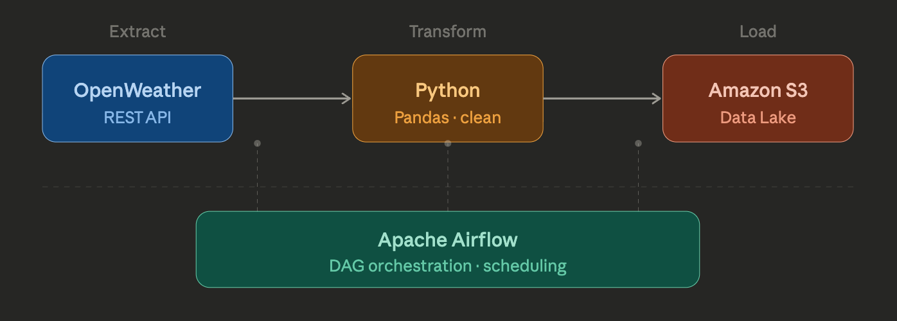

# Open-Weather-API-ETL-Project

This project is an end-to-end ETL pipeline that extracts weather data from the OpenWeather API, processes it, and stores it for downstream analytics.

Built with **Apache Airflow**, **Python**, and **AWS (S3)**.

---

## 🚀 Features

- 🌐 Extract real-time weather data via API  
- 🔄 Automated ETL pipeline using Airflow DAG  
- 🧹 Data transformation and cleaning  
- ☁️ Store processed data in AWS S3  
- ⏱️ Scheduled and repeatable workflows  

---

## 🏗️ Architecture

